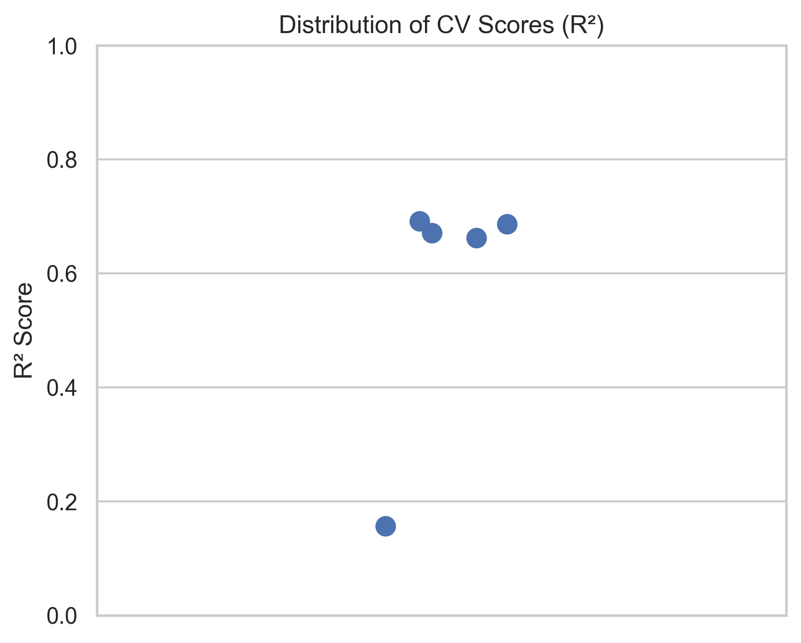
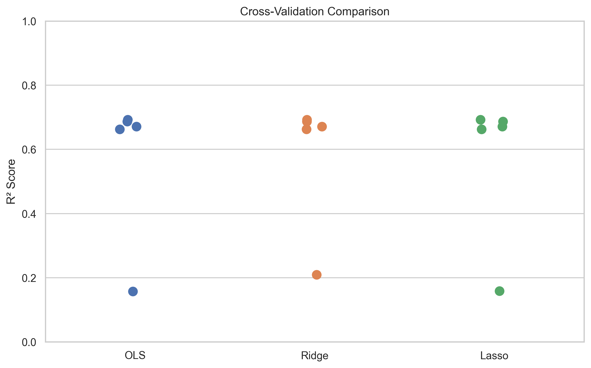

# 📘 House Price Prediction — Version 2
### *End-to-End Machine Learning Pipeline with Linear Models & Custom Gradient Descent*

---

## 1. Introduction

This project builds a complete machine learning pipeline to predict median house prices in California. Version 2 introduces major improvements over Version 1, including modular source code, engineered features, multiple linear models, systematic cross-validation, hyperparameter tuning, and a custom Gradient Descent Regressor implemented from scratch.

**Why it matters:** Accurate price prediction supports buyers, sellers, and policymakers; a modular, reproducible pipeline demonstrates production-ready ML engineering and provides a clear baseline for comparing linear models and regularization strategies.

---

## 2. Dataset

- **Source:** California Housing dataset (`sklearn.datasets.fetch_california_housing`)
- **Samples:** ~20,000
- **Features:** 8 numerical predictors
- **Target:** `median_house_value`
- **Type:** Tabular, numerical regression dataset

Preprocessing steps and feature transformations are implemented in `src/feature_engineering.py`. Summary statistics and exploratory visualizations are available in `notebooks/01_exploration.ipynb`.

---

## 3. Project Structure

```
house-price-ml-v2/
│
├── notebooks/
│   ├── 01_exploration.ipynb
│   ├── 02_model_evaluation.ipynb
│   ├── 03_sklearn_baseline.ipynb
│   ├── 04_cross_validation.ipynb
│   └── 05_pipeline_demo.ipynb
│
├── reports/
│   ├── metrics/
│   ├── plots/
│   └── report.md
│
├── src/
│   ├── config.py
│   ├── data_loader.py
│   ├── evaluation.py
│   ├── feature_engineering.py
│   ├── gradient_descent.py
│   ├── hyperparameter_tuning.py
│   ├── model_io.py
│   ├── preprocessing.py
│   └── train.py
│
├── README.md
└── requirements.txt
```

Version 2 emphasizes clean separation of responsibilities, reproducibility, and reusability across notebooks and scripts.

---

## 4. Methodology

### 4.1 Feature Engineering

Feature transformations include:

- Handling missing values
- Scaling using `StandardScaler`
- Ratio-based transformations (if applicable)
- Ensuring consistent preprocessing during training and inference

All functions are modularized inside `src/feature_engineering.py`.

---

### 4.2 Models Implemented

| Model | Implementation | Purpose |
|-------|----------------|----------|
| OLS (Linear Regression) | scikit-learn | Baseline model |
| Ridge Regression | scikit-learn | L2 regularization for stability |
| Lasso Regression | scikit-learn | L1 regularization for sparsity |
| Gradient Descent Regressor | Custom implementation | Manual optimization, educational comparison |

The custom Gradient Descent model supports:

- configurable learning rate
- iterations
- convergence tracking
- MSE loss optimization

---

### 4.3 Training Pipeline

A full training workflow is implemented in `src/train.py`, including:

- data loading
- feature engineering
- splitting into train/validation/test
- model training
- evaluation
- prediction

Run via: `python3 -m src.train`. This encapsulates the entire workflow into a reproducible pipeline.

---

## 5. Cross-Validation

Cross-validation is performed in `04_cross_validation.ipynb` using a 5-fold setup to measure model stability and variance.

Metrics include:

- Mean R² across folds
- Standard deviation of R²
- Fold-level scores for model comparison

> **Note:**  
> In industry, hyperparameter tuning typically performs cross-validation internally (nested CV).  
> In this project, CV and tuning are separated intentionally for educational clarity and modularity.

---

## 6. Hyperparameter Tuning

The notebook and `src/hyperparameter_tuning.py` explore:

- a predefined grid of α values for Ridge and Lasso
- evaluation using validation splits
- selection of hyperparameters based on highest validation R²

Best α values and detailed tuning results can be reproduced by running the cross-validation and tuning cells in the notebooks.

---

## 7. Results

### 7.1 Cross-Validation Results

Aggregated 5-fold CV summary (mean and std of R²):

| Model | Mean R² | Std R² |
|-------|---------|--------|
| OLS | 0.5738 | 0.2087 |
| Ridge | 0.5842 | 0.1879 |
| Lasso | 0.5740 | 0.2082 |

Fold-level R² (per fold):

| Fold | OLS | Ridge | Lasso |
|------|-----|-------|-------|
| 1 | 0.1569 | 0.2089 | 0.1581 |
| 2 | 0.6922 | 0.6921 | 0.6922 |
| 3 | 0.6866 | 0.6866 | 0.6866 |
| 4 | 0.6623 | 0.6624 | 0.6623 |
| 5 | 0.6709 | 0.6708 | 0.6709 |

Ridge achieves the highest mean R² and the lowest variance (std), indicating slightly better stability than OLS and Lasso under this setup.

**CV visualizations:**

- **R² distribution across folds:**  
  
- **Model comparison (box/bar):**  
  

---

### 7.2 Final Test Performance

Single-run test-set metrics from the notebooks (no CV on test):

**Custom Gradient Descent Regressor** (`02_model_evaluation.ipynb`):

| Metric | Value |
|--------|--------|
| MAE | 53,437.27 USD |
| RMSE | 74,661.01 USD |
| R² | 0.5746 |

**Sklearn Linear Regression (OLS)** (`03_sklearn_baseline.ipynb`):

| Metric | Value |
|--------|--------|
| MAE | 48,572.07 USD |
| RMSE | 66,645.49 USD |
| R² | 0.6752 |

The sklearn OLS baseline outperforms the custom Gradient Descent on this split (higher R², lower RMSE/MAE), which is expected when using the closed-form solution with the same features; the custom GD implementation is primarily for learning and comparison.

**Predicted vs actual and residuals:**

- **Custom GD — predicted vs actual:**  
  
- **Custom GD — residual distribution:**  
  
- **Sklearn OLS — predicted vs actual:**  
  
- **Sklearn OLS — residual distribution:**  
  

---

## 8. Custom Gradient Descent Regressor

Notebook `02_model_evaluation.ipynb` documents:

- update rule derivations
- cost function visualization
- convergence tracking
- comparison vs. scikit-learn OLS

**Training loss curve:**


This model demonstrates understanding of optimization fundamentals and how manual training differs from closed-form solutions.

---

## 9. Limitations

- Only linear models are explored
- Limited hyperparameter search space
- No tree-based or neural models
- Not optimized for deployment or production
- California Housing dataset may not generalize beyond domain

---

## 10. Future Work

- Add ElasticNet
- Expand hyperparameter search
- Implement nested cross-validation
- Introduce Random Forest or Gradient Boosting models
- Add UI or API for prediction demos
- Explore polynomial or interaction features

---

## 11. Reproducibility

The entire workflow is traceable through:

- modular source files in `src/`
- sequential notebooks in `notebooks/`
- deterministic random seeds (see `src/config.py`)
- a reproducible training pipeline: `python3 -m src.train`
- exported metrics in `reports/metrics/` and figures in `reports/plots/`

---

# End of Report
